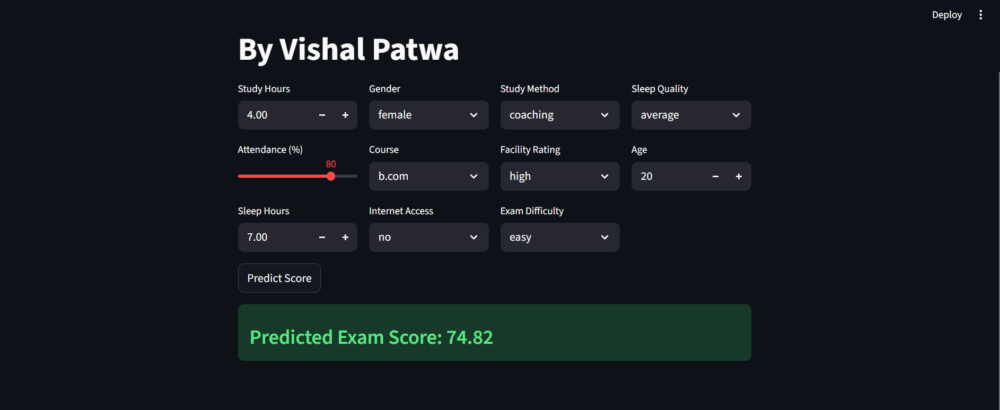

🎓 Student Exam Score Predictor
An advanced machine learning dashboard built with Streamlit and Scikit-learn to predict student exam scores based on study habits, attendance, and lifestyle factors.

🚀 Live Demo
Check out the live prediction app here: [[Hit URL for Live Demo](https://2005vishal-student-exam-predictor-app-8m3vti.streamlit.app/)]

📌 Project Overview
This project uses a HistGradientBoostingRegressor model to analyze various factors that influence a student's academic performance. It achieves a high R² score by evaluating both numerical data (study hours, sleep) and categorical data (study methods, exam difficulty).

Key Features:
Interactive Dashboard: Adjust study hours, attendance, and more using sliders and dropdowns.

Real-time Prediction: Get instant score estimates based on trained ML models.

Smart Categorical Handling: Uses LabelEncoder to process data like "Study Method" or "Course" accurately.

High Performance: Optimized with Streamlit's @st.cache_resource for instant loading.

📸 Screenshot
Here is a preview of the live prediction in action:



🛠️ Installation & Setup
To run this project locally on your machine (PyCharm/VS Code):

Clone the repository:

``` Bash
git clone https://github.com/YourUsername/YourRepoName.git
cd YourRepoName
```
Install dependencies:

``` Bash
pip install -r requirements.txt
```

Run the Streamlit App:

``` Bash
streamlit run app.py
```
📊 Dataset Features
The model considers the following factors:

Numerical: Age, Study Hours, Class Attendance, Sleep Hours.

Categorical: Gender, Course, Internet Access, Sleep Quality, Study Method, Facility Rating, Exam Difficulty.
